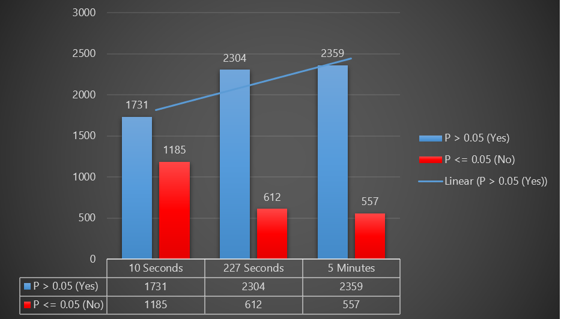
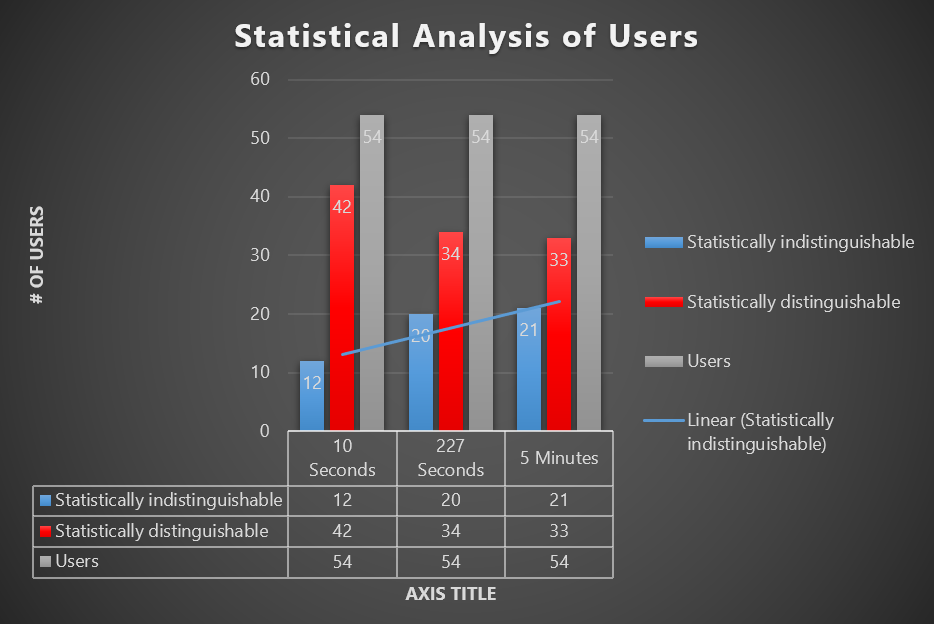

# The Project

  The project is about profiling internet users over a period based on the internet used by users. It demonstrates that internet users are statistically indistinguishable when compared to the internet usages of the same user over time while simultaneously being statistically distinguishable when compared to internet uses of other users.

Time Windows Analysis             |  Statistical Analysis
:-------------------------:|:-------------------------:
  |  

# Workflow

  The project is designed in Python language using Pandas API to perform data abstraction and manipulation on given datasets. The overall project is intended to execute into two steps, named as execution step 1 and execution step 2. The first stage is the one where data preprocessing is performed on given user data files. It stores the data in intermediary files. In the second step, the preprocessed data is taken one by one to complete the calculation of spearman rank correlation, z values, and final P values.

# The P Values Tables

  The P table is created for 54 users, so it has 54 \* 54 table data. It is difficult to fit the table in this report, so I am adding the complete file and a link as well to the full report.

## 10 seconds time window P values: ##

Rows = week1 (4th Feb 2013 to 8th Feb 2013)  
Columns = week 2 (11th Feb 2013 to 15th Feb 2013)  
CSV file: [https://usf.box.com/s/sr355f8ey0kioc6jysfma6ja9yja9ier](https://usf.box.com/s/sr355f8ey0kioc6jysfma6ja9yja9ier)  
Yes/No Table: [https://usf.box.com/s/786a130pq391kgiegtm0lc9q2x3s4gwh](https://usf.box.com/s/786a130pq391kgiegtm0lc9q2x3s4gwh)  

## 227 second time window P values: ##

Rows = week1 (4th Feb 2013 to 8th Feb 2013)  
Columns = week 2 (11th Feb 2013 to 15th Feb 2013)  
Complete CSV file: [https://usf.box.com/s/q16f2dpyi43fz5qslrcbk9bqtib4g445](https://usf.box.com/s/q16f2dpyi43fz5qslrcbk9bqtib4g445)  
Yes/No Table: [https://usf.box.com/s/p2tdwg8doty84m9mnvu5d7o6yxyo4hmz](https://usf.box.com/s/p2tdwg8doty84m9mnvu5d7o6yxyo4hmz)  

## 5-minute (300 seconds) time window P values: ##

Rows = week1 (4th Feb 2013 to 8th Feb 2013)  
Columns = week 2 (11th Feb 2013 to 15th Feb 2013)  
Complete CSV file: [https://usf.box.com/s/4mkheybsa39pjml9epji3b7lmue3xr81](https://usf.box.com/s/4mkheybsa39pjml9epji3b7lmue3xr81)  
Yes/No Table: [https://usf.box.com/s/je0lfm9u5os7ek8pss6y2gc4bnernfqx](https://usf.box.com/s/je0lfm9u5os7ek8pss6y2gc4bnernfqx)  

# Analysis of Time Windows

  Based on the collected data from the P-value table, it can be concluded that whether two users are distinguishable or indistinguishable.  When P ≤ 0.05, then it means that the correlation coefficient calculated for internet usage patterns for a user B is significantly smaller compare to user A. On the other hand, if P ≥ 0.05, then user B is not substantially lower than for user A.  

It can be concluded that if:
  P ≥  0.05 means that User B is identified as indistinguishable from User A  
  P ≤ 0.05 means that User B is identified as distinguishable from User A  

The given below graph represents the data of each time window in which based on the count of yes and no. Here yes, described that User A is statistically indistinguishable from another User B or P \&gt; 0.05. The no represents that User A is statistically distinguishable from another User B or P ≤ 0.05.  

## 1. Time window 10 analysis: ## 

Total &#39;Yes&#39; count or when P ≥ 0.05: There is a total of 1731 cells in the P-value matrix that are found to be indistinguishable from each other.  
Total &#39;No&#39; count or when P ≤ 0.05: There are a total of 1185 cells in the P-value matrix that are found to be distinguishable when compared to each other.  
The average number of P values that are greater than 0.05: **0.8154688682842**  

## 2. Time window 227 analysis ## 

Total &#39;Yes&#39; count or when P ≥ 0.05: There are a total of 2304 cells in the P-value matrix that are found to be indistinguishable from each other.  
Total &#39;No&#39; count or when P ≤ 0.05: There are a total of 612 cells in the P-value matrix that are found to be distinguishable when compared to each other.  
The average number of P values that are greater than 0.05: **0.7258264226098388**  

## 3. Time window 300 analysis: ## 

Total &#39;Yes&#39; count or when P ≥ 0.05: There is a total of 2359 cells in the P-value matrix that are found to be indistinguishable from each other.  
Total &#39;No&#39; count or when P ≤ 0.05: There is a total of 557 cells in the P-value matrix that are found to be distinguishable when compared to each other.  
The average number of P values that are greater than 0.05: **0.7092690053148268**  

# Analysis: statistically indistinguishable users

The given above graph represents the analysis of the users who are statistically indistinguishable compare to other users. The blue line represents the trends of the indistinguishable user when window size increases. The x-axis denotes the time window frame chosen for profiling the user data, and Y-axis indicates the number of users who were deemed to be statistically indistinguishable and represented din blue bat.  

# Results and conclusion

After analyzing the outcome of the data, I came to the following conclusions:  

1. For all time window chosen, each user&#39;s internet uses data in a week shows the statistically significant correlation for the corresponding time window across all weekdays in other weeks when compared with usages data of the same users.  
2. Even for very small-time windows such as 10 seconds, the internet uses for a user exhibits repeated behaviors when compared with another user, which we can see in the graphs and P-value table.  
3. From the charts, it can be concluded that for a longer profiling time window, a user&#39;s data overlaps with other user&#39;s uses. If we gradually decrease profiling windows, then a user&#39;s uses data correlates more with other users.  
4. It is also observed that uniqueness in the users&#39; usage profile increases as the size of the window decreases. That is because the number of indistinguishable users increases when window size decreases.  
5. This uniqueness behavior is an essential analysis as it can be used to authenticate a user. From the data for a time window, we can distinguish one user from another. The authentication can be performed by analyzing for the smaller window size, such as 10 seconds, and for larger window size such as 5 minutes to find out if decreases or increases affect the distinguishability of the users.  
6. I believe that this profiling can be used for passwordless authentication of the users by comparing uses and time from preciously stored use. If there is an anomaly, then either it can also be predicted that the user account might be hacked. If password-based authentication is used, then it can help to identify threat users and request a password reset to the real user.  

# Thank you
